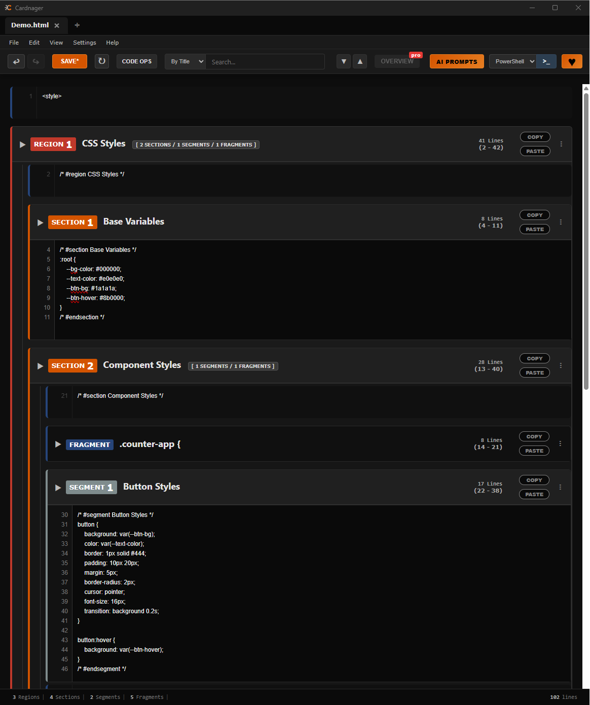

# Cardnager

**A code management tool for AI-assisted development.**

Cardnager parses large files into named collapsible cards so you can navigate, edit, and update AI-generated code safely — without scrolling through thousands of lines.



---

## What it does

When you work with AI to write code, the AI gives you blocks — a function, a style section, a component. The problem is that your file is one long scroll. Finding the right place to paste, checking what's already there, and keeping track of what changed is slow and error-prone.

Cardnager solves this by parsing your file into a visual card hierarchy:

```
REGION  ──  Top-level group (a major area of your file)
  │
  ├── SECTION  ──  Mid-level group (a class, a feature, a panel)
  │     │
  │     └── SEGMENT  ──  Small unit (one function or block of logic)
  │
  └── FRAGMENT  ──  Unmarked code (6+ lines) caught between named blocks
```

Every card shows the block name, type, line count, and line range. You expand a card to see and edit its code. You paste directly into it — Cardnager handles updating the file correctly.

---

## Features

- **Block-based navigation** — Collapse everything and see only the structure. Expand only what you need.
- **Copy & Paste workflow** — Every card has COPY and PASTE buttons. Get a block from your AI, paste it into the right card. Four safety checks run before anything is written: identity (no pointless overwrites), type mismatch, duplicate name, and hierarchy violation.
- **Code Ops** — Perform surgical operations across the entire file using token-based matching that ignores indentation differences and preserves it on write. Four modes:
  - **Replace** — swap a block of code for new code
  - **Insert Before** — inject code immediately before a match
  - **Insert After** — inject code immediately after a match
  - **Remove** — delete a line or block entirely, with a before/after diff preview
- **Duplicate Name Warning** — On every file open and refresh, Cardnager scans the entire block tree for duplicate names and shows an orange warning bar listing every collision. Duplicate names confuse the parser and break Code Ops matching.
- **Search** — Search by block title or by code content. Navigate between matches and replace all occurrences at once.
- **Undo / Redo** — Structural history that snapshots the entire file before every major operation. Up to 50 snapshots per tab, covering paste, Code Ops, add block, delete block, and backup restore.
- **Auto Backups** — Every save creates a timestamped backup in a `_backups` folder next to your file. Backups can be browsed and restored at any time, and every restore is itself undoable.
- **Recent Files** — A dedicated screen lists the last 20 files you worked on, with the time each was last opened. Open one file or select multiple at once.
- **Session Restore** — Reopens the files you had open last time automatically on startup.
- **AI Prompts** — A built-in library of prompts engineered for working with block-structured code. Covers project setup, structuring existing code into blocks, splitting and nesting blocks, and the correct code delivery format for AI assistants. Copy and paste directly into any AI assistant.
- **Terminal Launcher** — Open PowerShell, CMD, or Git Bash directly in the folder of the active file.
- **Raw View** — Toggle between card view and a plain text editor at any time.
- **Multi-tab** — Work with multiple files simultaneously.

---

## Supported languages

Cardnager works with any language that supports comments. Block markers use the comment syntax of your file:

| Language | Opening marker | Closing marker |
|---|---|---|
| JavaScript / TypeScript | `// #region Name` | `// #endregion` |
| CSS / SCSS | `/* #region Name */` | `/* #endregion */` |
| HTML | `<!-- #region Name -->` | `<!-- #endregion -->` |
| Python | `# #region Name` | `# #endregion` |
| C# | `// #region Name` | `// #endregion` |
| SQL | `-- #region Name` | `-- #endregion` |

The same pattern applies to `#section` / `#endsection` and `#segment` / `#endsegment`.

---

## Download

**[Download Cardnager Free — v1.0.0](https://github.com/lowrix1999/cardnager/releases/latest)**

Windows only. No installation required after setup.

---

## Community

Join the Discord server for updates, feedback, and support:
**[discord.gg/6YcTTHd28s](https://discord.gg/6YcTTHd28s)**

---

## License

MIT — free to use, modify, and distribute.
